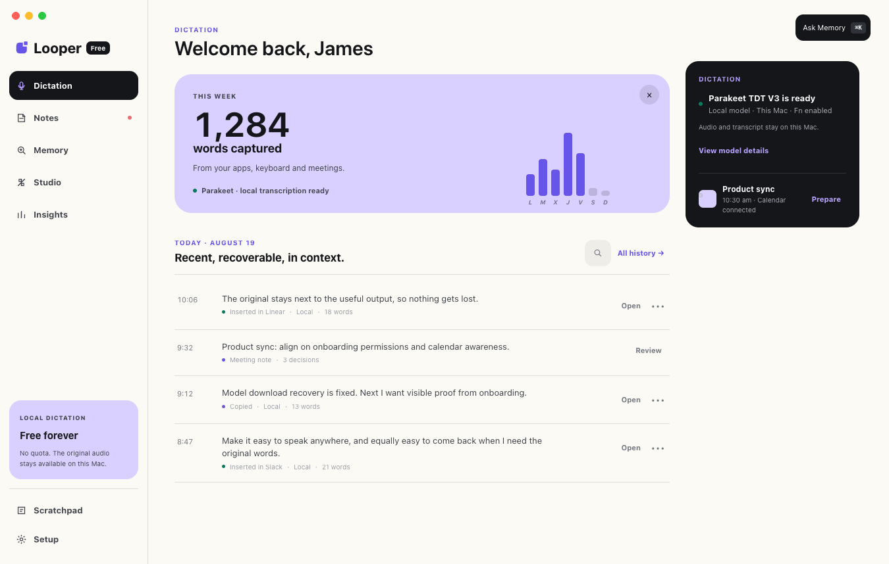
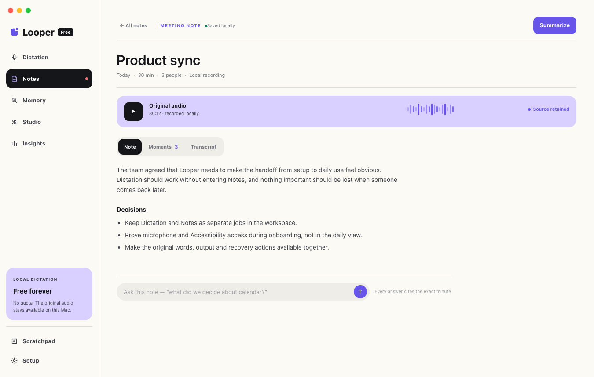

# Looper Desktop

Aplicación Tauri para macOS y Windows. Rust posee la captura nativa, los
atajos globales, el audio, la transcripción local, el almacenamiento, el menú
del sistema y la inserción de texto; React presenta los cuatro windows nativos
(`main`, `toast`, `meeting-awareness` y `settings`).

## Vista de producto





La experiencia de escritorio une dictado global, historial recuperable, notas de
reunión, audio original y Memory en un solo workspace. La captura nativa sigue
siendo local al sistema operativo; la interfaz web no sustituye estas
capacidades.

## Capacidades

- Dictado global con inserción en la aplicación enfocada.
- Transcripción local o mediante el proveedor remoto configurado.
- Reuniones, importación de audio, transcripción en vivo, marcadores y
  exportación.
- Library y Memory para buscar dictados, notas y reuniones sin perder el audio
  de origen.
- Studio, vocabulario, reemplazos, estilos y configuración de permisos.
- Actualizaciones firmadas desde GitHub Releases cuando existe una versión
  publicada.

## Desarrollo local

Desde la raíz del repositorio:

```sh
make install
cp apps/desktop/.env.example apps/desktop/.env.local
# Define VITE_CONVEX_URL si necesitas cuenta, sync o funciones remotas.
make dev
```

Para compilar un artefacto macOS local sin firma:

```sh
make build-download
```

Los resultados quedan en:

- `apps/desktop/src-tauri/target/release/bundle/macos/Looper.app`
- `apps/desktop/src-tauri/target/release/bundle/dmg/Looper_<version>_aarch64.dmg`

El nombre exacto del DMG incluye la versión y arquitectura actuales. Este
artefacto es para QA o transferencia privada: macOS puede mostrar una alerta
porque no está notarizado ni firmado con un certificado de distribución.

## Release firmado

El workflow manual `.github/workflows/desktop-release.yml` debe ejecutarse
desde `main` y comprueba que `package.json`, Cargo y el commit publicado estén
alineados. Genera:

- macOS Apple Silicon: `.app` y `.dmg`.
- Windows x64: `.msi` y `.exe` NSIS.
- `latest.json` y firmas para el updater de Tauri.

El workflow necesita `TAURI_SIGNING_PRIVATE_KEY` y
`TAURI_SIGNING_PRIVATE_KEY_PASSWORD`. Los instaladores de release son la fuente
para distribución; `make build-download` nunca reemplaza la firma, notarización
ni verificación del CI.

## Verificación

```sh
make lint-desktop
make test-desktop
pnpm --dir apps/desktop build
```

Estas comprobaciones cubren frontend, Rust y empaquetado local. La captura real
del micrófono, los atajos globales, permisos del sistema, firma/notarización y
la instalación desde un release todavía requieren validación nativa en el
macOS o Windows objetivo.
