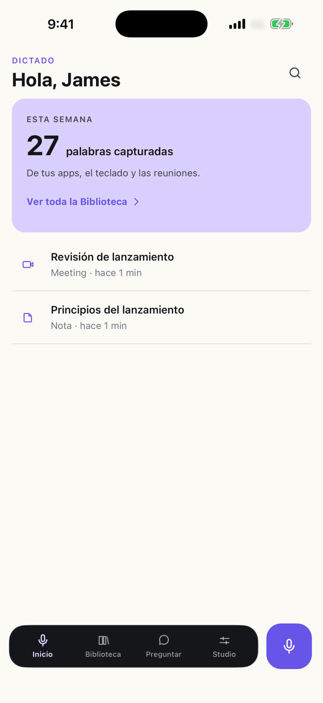
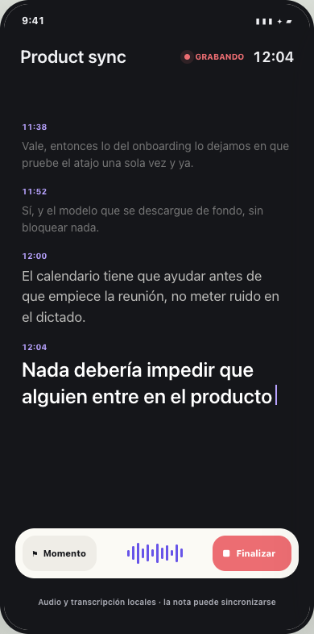
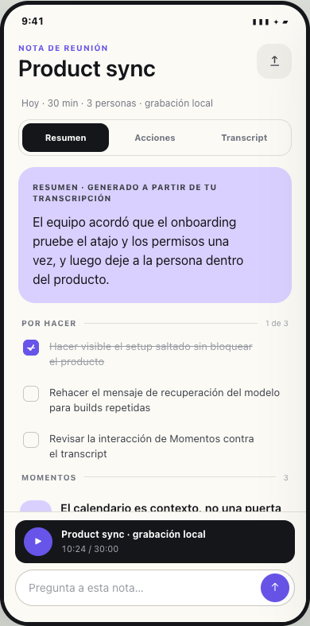

# Looper Mobile

Aplicación móvil React Native con Expo y Convex. La disponibilidad del dictado
depende de la plataforma: Android puede usar el modelo local cuando está
instalado; la extensión de teclado iOS utiliza el proveedor remoto porque no
puede leer el modelo privado de la aplicación host.

## Producto

La app cubre el ciclo completo de captura en el teléfono:

- Dictado rápido desde el botón de captura o desde el teclado nativo.
- Reuniones con transcripción en vivo, controles de grabación y nota final.
- Library para revisar dictados y reuniones, Ask para consultar el historial y
  Studio para estilos, Smart Modes, idioma y conocimiento del teclado.
- Sincronización autenticada con Convex; el audio y el reconocimiento local
  permanecen en el dispositivo cuando la plataforma y el modelo lo permiten.

| Dictado | Captura en vivo | Nota de reunión |
| --- | --- | --- |
|  |  |  |

Estas imágenes son capturas de la app Expo real generadas con los flujos
deterministas de Goldie (`pnpm goldie:capture`).

## Desarrollo

```sh
pnpm --filter @looper/mobile prebuild
pnpm --filter @looper/mobile ios
# o
pnpm --filter @looper/mobile android
```

El teclado y el reconocimiento local contienen código nativo, por lo que requieren
un development build. Expo Go no los incluye.

Configura `EXPO_PUBLIC_CONVEX_URL` antes de abrir la app. El teclado recibe sólo
el refresh token de Convex y la configuración necesaria a través del almacén
compartido del sistema operativo; la app no lo muestra ni lo registra.

## Activar y probar el teclado

Cada plataforma instala una extensión nativa distinta:

1. Ejecuta `prebuild` y abre un development build en el simulador o dispositivo.
2. En iOS, ve a **Settings → General → Keyboard → Keyboards → Add New Keyboard**
   y habilita **Looper**. Activa **Allow Full Access** sólo si vas a usar el
   proveedor remoto; el modo local no necesita ese permiso.
3. En Android, abre **Settings → System → Keyboard → On-screen keyboard**,
   habilita **Looper** y selecciónalo desde el selector de teclado.
4. Abre una app con un campo de texto, cambia a Looper y mantén pulsado el
   micrófono. El texto insertado debe aparecer en el campo y la entrada debe
   quedar en Library.

La app pide micrófono cuando se inicia una captura, no al abrir la pantalla. La
prueba del teclado requiere un build nativo instalado y permisos del sistema;
el typecheck y las pruebas unitarias no sustituyen esa comprobación física.

Para reproducir las capturas de producto en ambos idiomas:

```sh
pnpm goldie:build
pnpm goldie:capture
pnpm goldie:verify
```
