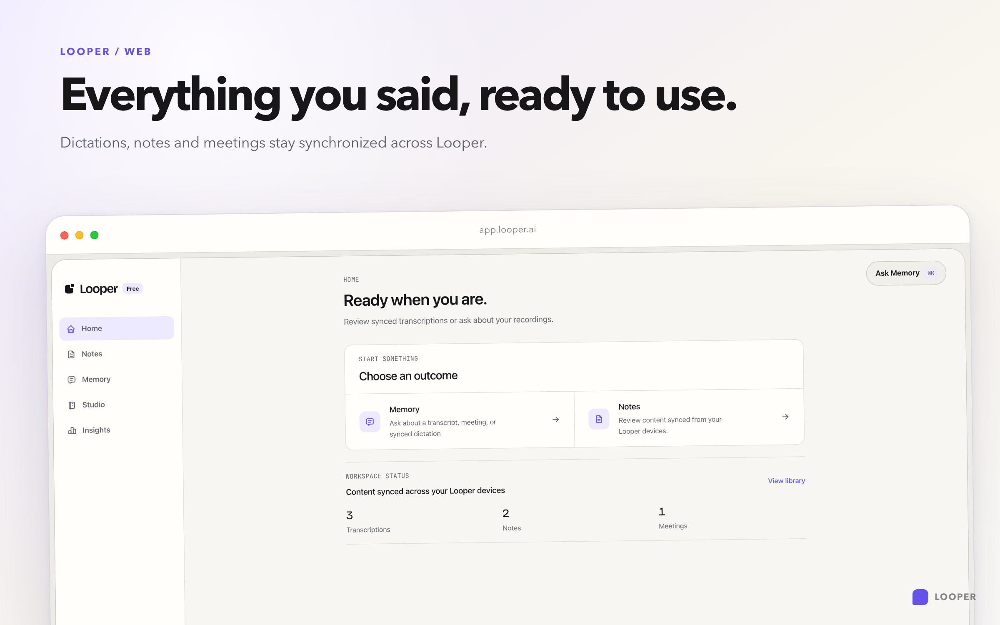
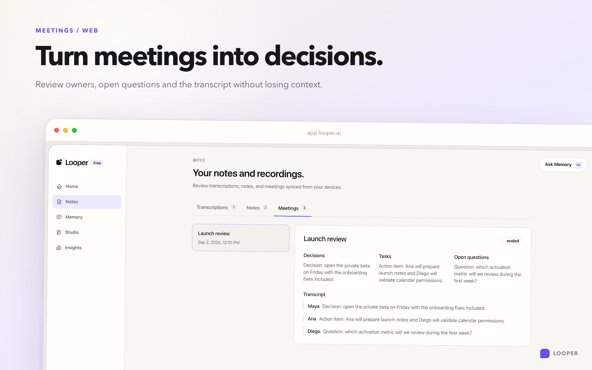
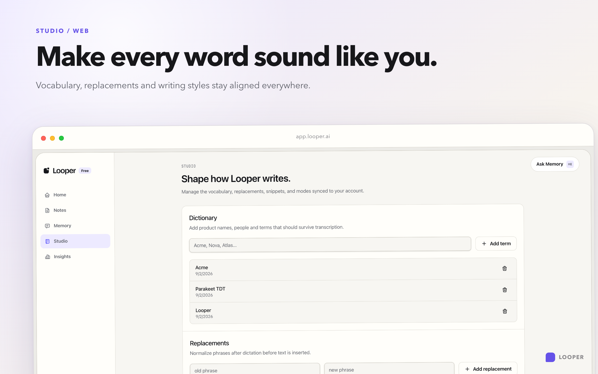

# Looper Web

Workspace React/Vite para revisar el contenido sincronizado de Looper desde el
navegador. Web no captura micrófono ni audio: Desktop y Mobile son los dueños
de la captura y envían el contenido sincronizado a Convex.

## Producto

- Home y Library para dictados, notas y reuniones sincronizados.
- Revisión de reuniones con resumen, decisiones, owners, preguntas abiertas,
  momentos, audio original y transcript.
- Ask para consultar el historial con fuentes y contexto del recording.
- Studio para vocabulario, reemplazos, estilos y Smart Modes.
- Cuenta, uso, billing, roadmap y changelog con locales English y Español.

| Home | Meeting review | Studio |
| --- | --- | --- |
|  |  |  |

Las imágenes son capturas Retina de la aplicación Vite real. Para regenerarlas
con datos de preview aislados:

```sh
pnpm web:previews
```

## Desarrollo y verificación

```sh
pnpm --filter @looper/web dev
pnpm --filter @looper/web build
pnpm --filter @looper/web lint
pnpm --filter @looper/web test
pnpm --filter @looper/web e2e
```

Configura `apps/web/.env.local` a partir de `.env.example` y define
`VITE_CONVEX_URL`. Las credenciales de proveedores AI, pagos y correo sólo
pertenecen al backend.

